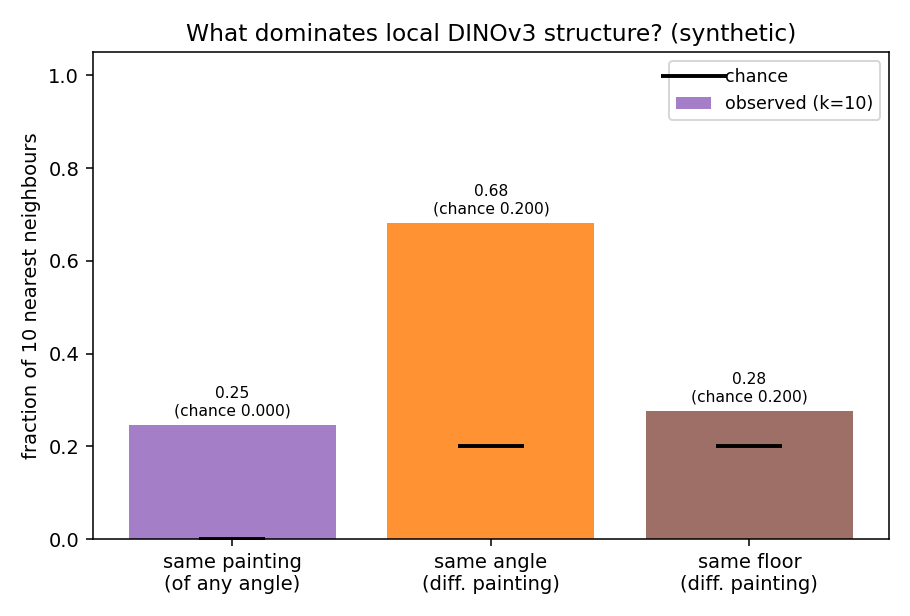
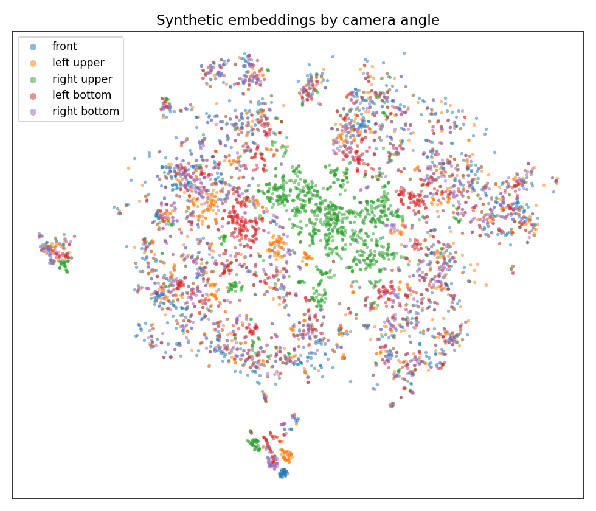
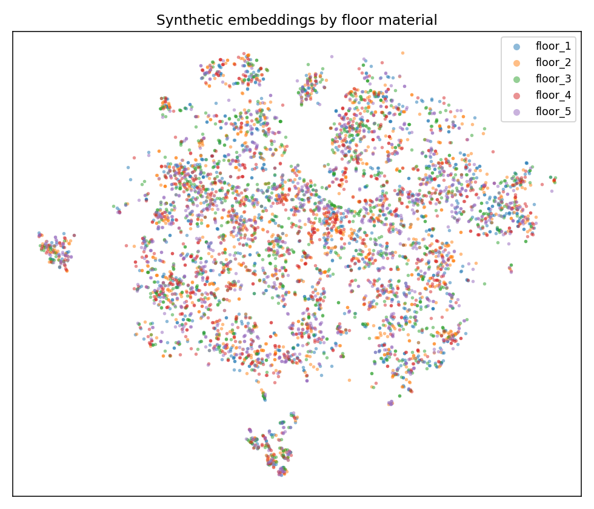
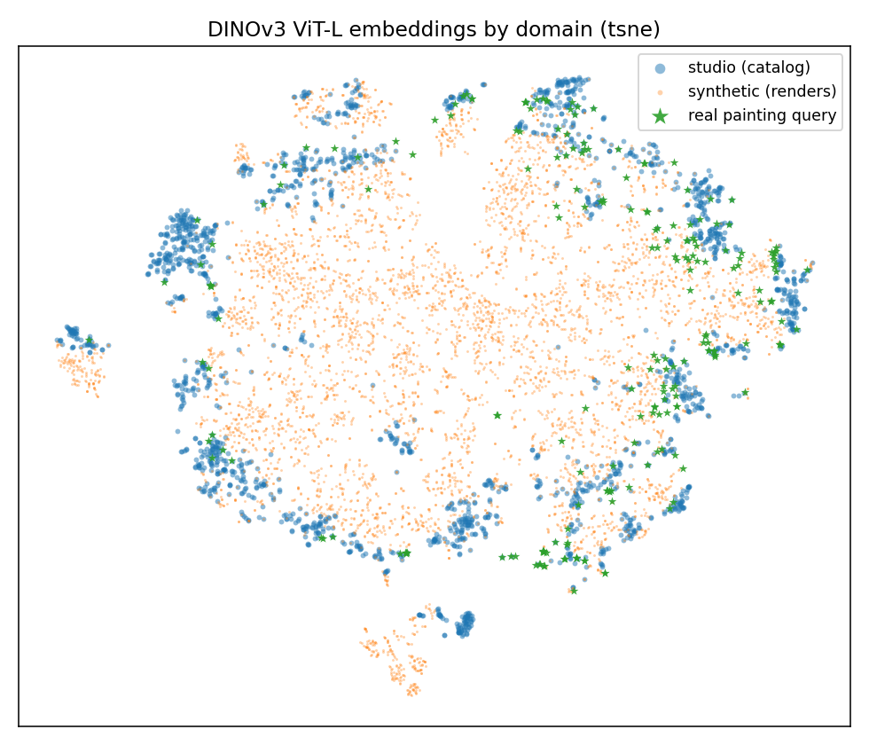
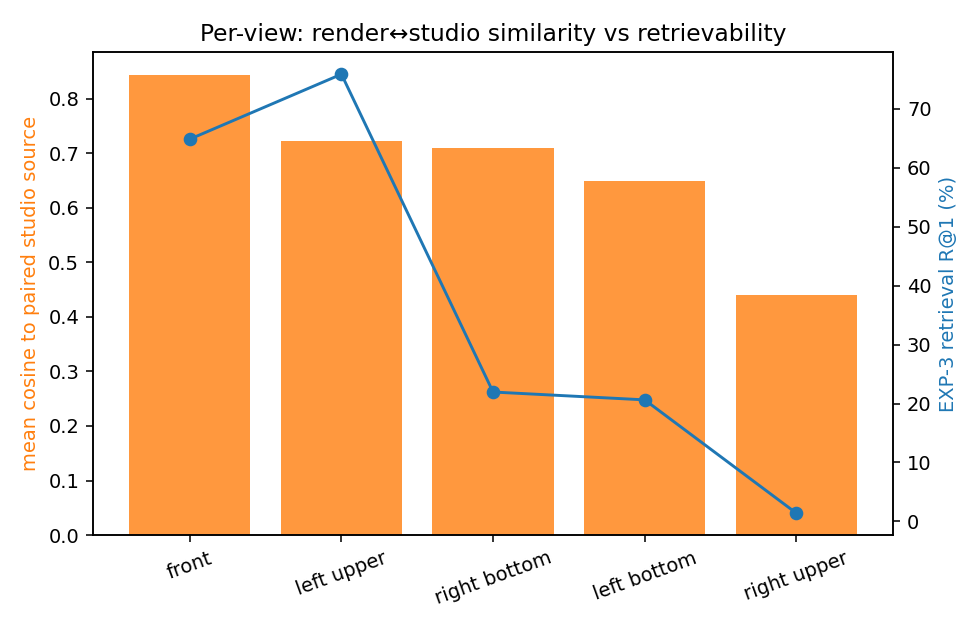

# DINOv3 embedding-space analysis of the synthetic gallery dataset

*What organizes the foundation-model representation of our synthetic renders — camera
angle, procedural scene hyperparameters, or painting identity — and how far is synthetic
from real? (Met / VISART fork. Lab-notebook entry: [`EXPERIMENTS.md` → EXP-7](../../EXPERIMENTS.md).)*

## TL;DR

- **DINOv3 keys on painting *identity*, not on rendering nuisances.** A render's nearest
  neighbours are overwhelmingly the *other views of the same painting* (~1500× over chance).
- **Camera angle is the dominant *cross-painting* axis** — 99% linearly decodable and 68% of
  cross-painting neighbours share the query's angle — but it is a smooth linear direction, **not
  isolated clusters**.
- **Procedural hyperparameters (floor, placard) are only weakly encoded** once you remove a
  dataset confound; the background randomization is largely ignored. Light randomization is not
  recoverable from metadata and was not tested.
- **The three domains (studio catalog / synthetic renders / real visitor photos) are
  near-perfectly separable** — there is a clean, large domain gap.
- **The renders are "too clean":** no synthetic view lands closer to the real-photo region than
  the studio catalog images already do. The synthetic data's value is therefore **augmentation /
  viewpoint-invariance**, not landing on the real-photo manifold.
- The **EXP-3 camera-framing bug is independently corroborated** by an unrelated model + metric.

---

## 1. Setup

| | |
|---|---|
| **Backbone** | DINOv3 **ViT-L/16** (`facebook/dinov3-vitl16-pretrain-lvd1689m`), **frozen, zero-shot** |
| **Feature** | CLS token, `aspect512` preprocessing (long side→512, mult-of-16), **L2-normalized** (cosine geometry) |
| **Why this** | Model-intrinsic representation (no task-specific projector, no train-fit PCA-whitening). The real-side features **reuse art-research's already-extracted Met features** with the *identical* model + preprocessing, so synthetic and real are directly comparable. |

Three point clouds:

| cloud | what | N |
|---|---|--:|
| **synthetic** | gallery renders, all 4,952 paintings × 5 camera views | 24,760 |
| **studio** | the catalog source photo `MET/<id>/0.jpg` each render was generated from (paired) | 4,952 |
| **real query** | real visitor photos of **paintings** from the Met test set (broad def.; 173 strict) | 221 |

Recoverable procedural factors per render (from each `metadata.json`, via
[`scripts/synth_meta.py`](../../scripts/synth_meta.py)): **camera angle** (5), **floor material**
(5: `floor_1..5`), **placard-x** (continuous), **canvas aspect** (continuous). ⚠️ **Light shape /
energy / spread are *not* recorded in metadata**, so light randomization could not be tested.

---

## 2. What dominates the embedding structure?

The most direct probe is the **label composition of each render's 10 nearest (cosine) neighbours**.
Because the scene is randomized **once per painting**, all 5 views of an artwork share one floor —
so "same-painting" neighbours are *automatically* "same-floor" (and, since each painting has one
render per angle, *never* "same-angle"). We therefore condition the angle/floor affinity on
**different-painting** neighbours to remove that confound.



| a neighbour shares… | observed | chance | enrichment |
|---|--:|--:|--:|
| **same painting** (any angle) | **0.247** | 0.0002 | **~1500×** |
| **same angle** (different painting) | **0.682** | 0.20 | 3.4× |
| same floor (different painting) | 0.277 | 0.20 | 1.4× |

**Global decodability** of each factor from the raw embedding (50/50 stratified split):

| factor (synthetic only) | linear-probe | kNN | silhouette | chance |
|---|--:|--:|--:|--:|
| **camera angle** (5) | **0.990** | 0.718 | 0.023 | 0.20 |
| floor material (5) | 0.595 | 0.503 | −0.005 | 0.21 |
| placard-x quartile (4) | 0.550 | 0.543 | −0.011 | 0.25 |
| canvas aspect quartile (4) *(content-correlated)* | 0.728 | 0.673 | −0.006 | 0.25 |

**Reading.** Identity dominates locality. Camera **angle** is the strongest *systematic* axis — it is
~perfectly **linearly** separable (0.99) and clearly organizes cross-painting neighbours (0.68), yet
its silhouette ≈ 0 and kNN-by-angle is only 0.72: it is a smooth direction layered on top of content,
not a set of discrete blobs. **Floor and placard barely beat chance** — the model ignores the
randomized background. (Aspect ratio is more decodable, but it is the painting's actual *shape*, i.e.
content, not a nuisance.)

The t-SNE views make this visible — angle shows soft structure (note the broken `right upper` view
peeling off), while floor material is essentially salt-and-pepper:

| by camera angle | by floor material |
|---|---|
|  |  |

---

## 3. Synthetic vs. real: a clean, large domain gap

All three domains are **near-perfectly linearly separable**:

| domains | linear separability |
|---|--:|
| studio / synthetic / real-query (3-way) | **0.994** |
| studio vs. synthetic | 0.992 |
| studio vs. real query | 0.965 |
| synthetic vs. real query | 0.969 |



*(PCA view: [`figures/proj_domain_pca.png`](figures/proj_domain_pca.png).)*

**The renders are "too clean".** Centroid cosine distances tell the sharper story — the gap we
ultimately care about is **studio ↔ real-query = 0.24**:

| centroid pair | cosine distance |
|---|--:|
| studio ↔ real query | **0.240** |
| **synth `front`** ↔ studio | **0.152** |
| synth `front` ↔ real query | 0.237 |
| synth `left upper` ↔ studio | 0.301 |
| synth `right upper` ↔ studio | 0.621 |

The synthetic **front** view sits *closer to studio* (0.152) than the real query photos do (0.240),
and **no** synthetic view lands meaningfully closer to the real-query centroid than studio already is
(front↔query 0.237 ≈ studio↔query 0.240). So in frozen-DINOv3 space the renders reproduce
viewpoint / glass / lighting variation but **not** the real phone-photo shift. This is consistent
with EXP-4's observation that adding synthetic data helped *all* query types: the benefit is more
plausibly an **augmentation / invariance** effect than the renders occupying the real-photo region.

---

## 4. The camera-framing bug, corroborated independently

For each render we measure the cosine to its **own** studio source painting. This bottoms out exactly
where EXP-3's retrieval R@1 (a *different* model — R18-SWSL — and a *different* metric) does:



| view | mean cos → own studio source | EXP-3 retrieval R@1 (%) |
|---|--:|--:|
| front | 0.843 | 64.84 |
| left upper | 0.723 | 75.85 |
| right bottom | 0.709 | 21.95 |
| left bottom | 0.648 | 20.62 |
| **right upper** | **0.440** | **1.41** |

`right upper` renders are far from their own source (0.44 vs front's 0.84) and the most isolated in
centroid space (0.62 from studio) — the grazing/edge-on framing bug, confirmed from an independent
direction. (The mid-views' cosine ordering does not perfectly track R@1, because retrievability is
*discriminability*, not raw similarity, and EXP-3 used a different backbone.)

---

## 5. Implications

- **DINOv3 is a strong base for this dataset:** it is invariant to the synthetic background
  randomization and groups by artwork content — exactly what instance recognition needs.
- **Don't over-read per-angle synthetic numbers** until the rig is fixed: the broken `right upper`
  view (and the foreshortened `*bottom` views) are genuine feature-space outliers.
- **To actually close the studio→real-photo gap**, the renders may need to be *less* clean — real
  visitor-photo nuisances (phone-camera optics, oblique perspective, real ambient lighting, motion
  blur, occlusion) rather than only viewpoint/floor variety.
- **Natural follow-ups:** (a) repeat on **DINOv3-7B** or on our **fine-tuned** model to see whether
  training pulls synthetic toward the real-query region; (b) visual contact sheets of cross-domain
  nearest neighbours to make the "too clean" finding concrete.

---

## 6. Caveats

- Frozen **DINOv3 ViT-L** zero-shot — not the fine-tuned R18-SWSL of the main results, nor the 7B model.
- **L2-normalized CLS cosine** geometry — not the eval pipeline's train-fit PCA-whitening.
- **Light randomization not recoverable** from `metadata.json`; only floor/placard/aspect/angle tested.
- Real query cloud is small (221 broad / 173 strict painting photos).

---

## 7. Reproduce

Run in `.venv-dino` (DINOv3 + `transformers`; analysis also needs `scikit-learn` + `matplotlib`).

```bash
# 1) extract frozen DINOv3 ViT-L CLS features over the 24,760 renders (GPU, ~2 min on H100)
sbatch extract_synth_dino.slurm
# 2) assemble real reference clouds (reuse art-research ViT-L Met feats) + run the analysis (CPU)
sbatch analysis_synth_dino.slurm
# -> data/synth_dino/analysis/{summary.json, *.png}
```

Pipeline: [`scripts/synth_meta.py`](../../scripts/synth_meta.py) (procedural-factor parser) ·
[`scripts/extract_synth_dino.py`](../../scripts/extract_synth_dino.py) ·
[`scripts/assemble_real_dino.py`](../../scripts/assemble_real_dino.py) ·
[`scripts/analyze_synth_dino.py`](../../scripts/analyze_synth_dino.py).
All numbers above are from `data/synth_dino/analysis/summary.json`.
