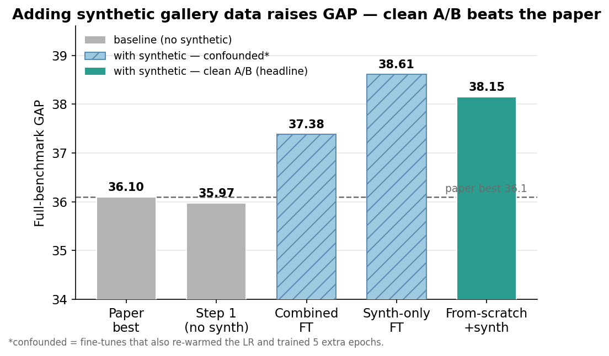
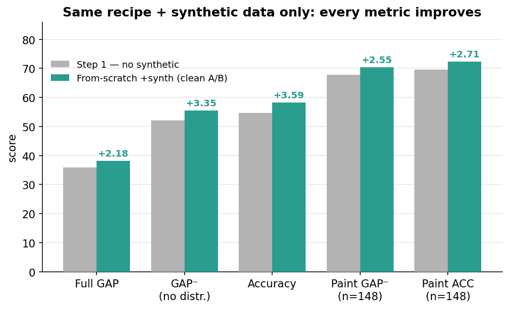
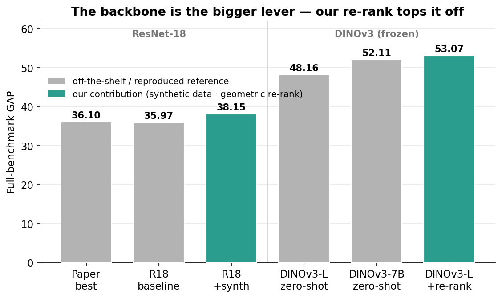

# Beating the Met benchmark: synthetic data, then a stronger backbone

*Two threads from this project, in sequence. **First** (steps 1–4): retrain the original recognition
model with our synthetic "phone-photos-in-a-gallery" renders added, and ask whether that **alone** —
same recipe, no new method — beats the paper. **Then** (step 5): pivot to a foundation backbone (DINOv3)
plus a geometric re-rank — the new method. (Met / VISART fork; lab notebook:
[`EXPERIMENTS.md` → EXP-1, EXP-4, EXP-6](../../EXPERIMENTS.md).)*

## What we did, in one paragraph

The Met benchmark trains on **clean studio catalog photos** but is tested on **real visitor phone
photos** — a hard "looks different" gap. Our hypothesis: adding **synthetic** gallery renders of the
paintings to the training set should help recognition *on its own*, before we add any new method. To
test it without fooling ourselves, we first **reproduced the paper's best model from scratch** as a
baseline, then **retrained the exact same model with the synthetic renders added** — identical recipe,
only the training data changed — and evaluated both on the **original** benchmark (the synthetic images
are used *only for training*, never as answers). The synthetic images never enter the test database, so
the two runs are directly comparable and any difference is down to the added data.

> **How to read the numbers.** The task: given a query photo, name which of ~224k museum exhibits it
> shows — or correctly reject it as "not in the collection". All scores are 0–100, higher is better.
> - **GAP** (Global Average Precision) — the **headline metric**: ranks *every* query by the model's
>   confidence and rewards putting correct, confident answers first *and* giving junk low confidence.
> - **GAP⁻** — the same, but scored on the real exhibit queries only (junk removed): pure recognition,
>   without the "reject the junk" part.
> - **Accuracy (ACC)** — of the in-collection queries, the fraction whose top guess is correct.
> - **distractors / "junk"** — query photos of things *not* in the collection (other artworks, non-art).
>   A good model gives them low confidence. They make GAP much harder than plain accuracy.
> - **paintings (strict)** — the 173 test queries that are paintings (MetObjects `Classification ==
>   "Paintings"`). Our contribution targets paintings, so we track them separately. ("broad" = a looser
>   painting definition, 221 queries.)
> - **clean A/B** — two runs identical in *everything* except the one thing under test (here: +synthetic
>   data). Any difference is attributable to that one change — no other explanation.

## TL;DR

- **Adding synthetic gallery data lifts full-benchmark GAP from 35.97 → 38.15** with the *identical*
  training recipe — a clean **+2.18**, and it **beats the original paper's best single model (36.1)**.
- **Every metric improves, not just paintings:** GAP⁻ +3.35, accuracy +3.59, paint GAP⁻ +3.28, paint
  accuracy +3.47 (strict; broad paintings move even more, ~+4).
- **Non-painting queries improve too** — so this isn't simply "more painting data". The diverse renders
  teach broadly useful lighting / viewpoint / glass invariance that helps real photos across the board.
- Two quicker **fine-tuning** variants gave comparable or larger gains (synth-only 38.61, combined 37.38)
  but are **confounded** (they also trained longer); the from-scratch run removes that doubt.
- **Bottom line so far: synthetic data helps on its own.** Contribution 1 stands — before any new method.

**Then we changed the backbone (step 5):**
- **A frozen DINOv3 foundation model nearly doubles GAP** out of the box: 35.97 → **48.16** (ViT-L),
  **52.11** (the 7B model). *(Zero-shot DINOv3 on Met is the DINOv3 paper's own result, not our contribution.)*
- **Our new method — a geometric re-rank — lifts DINOv3 ViT-L to GAP 53.07** (+4.9), by rejecting
  distractors with accuracy left untouched; it already edges the 8× larger 7B model.
- **The open question that links both threads:** does adapting DINOv3 *on our synthetic data* help even
  more? That fine-tuning ablation is running now.

---

## 1. The task, the baseline, and the four models

We compare four versions of the *same* R18-SWSL contrastive model (the paper's best single model:
ResNet-18 SWSL backbone → GeM pooling → projector, trained with online hard-pair mining; paper name
*Con-Syn+Real-closest*). Only the **training data** and **how long we trained** change:

| model | training data | recipe | role |
|---|---|---|---|
| **Step 1 — baseline** | studio only (397k) | from SWSL, 10 epochs | reproduces the paper |
| Combined FT | studio + synthetic | fine-tune the baseline, +5 epochs | quick test |
| Synth-only FT | synthetic only | fine-tune the baseline, +5 epochs | quick test |
| **From-scratch +synth** | studio + synthetic (422k) | from SWSL, 10 epochs *(same as baseline)* | **clean A/B** |

The **synthetic dataset** is 24,760 Blender gallery renders — 4,952 Met paintings × 5 camera views —
added to the 397,121 studio images for training (→ `data/gt_aug`). Our **baseline reproduces the paper**:
GAP **35.97** vs the paper's 36.1 (and 36.10 on the authors' own descriptors), so it's a faithful
starting point. Everything below is measured on the **original** studio database and real test queries,
with the kNN classifier's `K` and temperature tuned on the validation set — exactly as in step 1.

---

## 2. Headline: synthetic data raises GAP — and clears the paper



| configuration | training data | full GAP | Δ vs baseline |
|---|---|--:|--:|
| Step 1 — baseline *(= paper)* | studio | 35.97 | — |
| Combined FT *(confounded)* | studio + synth | 37.38 | +1.41 |
| Synth-only FT *(confounded)* | synthetic | 38.61 | +2.64 |
| **From-scratch +synth** *(clean A/B)* | studio + synth | **38.15** | **+2.18** |

*Δ vs baseline = GAP minus the 35.97 baseline. The dashed line in the figure is the paper's best single
model (36.1); every synthetic configuration sits above it.*

**Plain reading:** *every* way of adding the synthetic data beats both our baseline and the published
number. The bar we trust most — the solid teal **from-scratch +synth** — lands at **38.15 GAP**, a clean
+2.18 over baseline and +2.05 over the paper.

---

## 3. The clean A/B, metric by metric

The from-scratch run changes *one thing* versus the baseline (it adds synthetic data; same 10 epochs,
same learning-rate schedule, same everything else). So this is the honest measure of what the data buys:



| metric | Step 1 baseline | From-scratch +synth | Δ |
|---|--:|--:|--:|
| Full GAP | 35.97 | **38.15** | **+2.18** |
| GAP⁻ (no distractors) | 52.14 | **55.49** | **+3.35** |
| Accuracy | 54.64 | **58.23** | **+3.59** |
| Paint GAP⁻ (strict) | 67.81 | **71.09** | **+3.28** |
| Paint ACC (strict) | 69.36 | **72.83** | **+3.47** |
| Paint GAP⁻ (broad) | 65.92 | 69.90 | +3.98 |
| Paint ACC (broad) | 67.42 | 71.49 | +4.07 |

*Same model, same recipe, +synthetic. All seven numbers go up.*

**The gain is broad, not just paintings.** Accuracy on *all* in-collection queries rises +3.59, including
non-painting exhibits the synthetic set never depicts. That tells us the renders aren't helping by simply
adding painting examples — they teach the model **lighting, viewpoint, and glass-glare invariance** that
transfers to real photos generally. (A companion analysis of *what* the synthetic images vary is in the
[DINOv3 embedding study](../synth-embedding-analysis/README.md).)

---

## 4. Were the gains real, or just "more training"?

The two fine-tuning runs are **confounded**: to fine-tune we re-warmed the learning rate (1e-8 → 1e-7)
and trained **5 extra epochs**, so part of their lift could be the extra training rather than the
synthetic data. The from-scratch run is built precisely to remove that doubt:

| run | what differs from baseline | full GAP | clean? |
|---|---|--:|:--:|
| Synth-only FT | +5 epochs at a re-warmed LR; synthetic data only | 38.61 | ✗ confounded |
| Combined FT | +5 epochs at a re-warmed LR; studio + synthetic | 37.38 | ✗ confounded |
| **From-scratch +synth** | **nothing but the added data** (same 10 epochs, same LR) | **38.15** | ✓ clean A/B |

**Verdict:** the clean run, with no extra training of any kind, still gains **+2.18 GAP**, and it lands
**within 0.5** of the best confounded run (38.15 vs 38.61). So the improvement is **real and attributable
to the synthetic data itself** — the fine-tunes' larger numbers were mostly the data too, not the extra
epochs. (Curiously, fine-tuning on synthetic *only* edges out mixing it with studio data — plausibly
because mixing 397k studio + 25k synthetic dilutes the synthetic signal each epoch.)

---

## 5. Continuation: a much stronger backbone (DINOv3)

The +2.18 GAP from synthetic data is real — but it's a *small* lever next to the **backbone**. Swapping
the ResNet-18 for a **frozen DINOv3** foundation model (used as-is, no training — we just feed its
features into the *same* kNN classifier and metrics) nearly **doubles** GAP:



| backbone (frozen, zero-shot) | full GAP | GAP⁻ | ACC |
|---|--:|--:|--:|
| R18-SWSL — our step-1 baseline | 35.97 | 52.14 | 54.64 |
| R18-SWSL + synthetic *(§3 of this doc)* | 38.15 | 55.49 | 58.23 |
| **DINOv3 ViT-L** | **48.16** | 72.14 | 77.07 |
| **DINOv3-7B** | **52.11** | 75.46 | 81.95 |

*"Zero-shot" = the pretrained model is used directly, no fine-tuning. Everything is scored in our exact
kNN + GAP pipeline, so these numbers are comparable to the synthetic-data rows above.*

> **Honesty note.** That DINOv3 nearly doubles GAP on Met is **DINOv3's own published claim**, not our
> contribution. We reproduced it in our pipeline to get a faithful starting point — the contribution is
> what we add *on top* (§6).

---

## 6. The new method: a geometric re-rank on DINOv3

DINOv3 has one clear weakness. It's excellent at **ranking the right painting first** (GAP⁻ = 72) but
poor at **rejecting distractors** — query photos of things that aren't in the collection (full GAP = 48).
That 24-point gap between the two is exactly what GAP penalises.

The fix is **geometric verification**. For a query's top-50 candidates, we check whether their image
*patches* actually line up — mutual nearest-neighbour patch matches, filtered by RANSAC (the classic
"are these two pictures the same thing in the same arrangement?" test). A true match has many consistent
patch correspondences; a distractor has few. We fold that patch-match score into the model's
**confidence** as a gate, which leaves the top-1 guess — and therefore accuracy — untouched:

| DINOv3 ViT-L (our pipeline) | full GAP | GAP⁻ | ACC |
|---|--:|--:|--:|
| baseline (CLS-feature kNN) | 48.16 | 72.14 | 77.07 |
| **+ geometric re-rank gate** | **53.07** | **74.69** | 77.07 |

*The gate lifts both GAP (+4.9) and GAP⁻ (+2.55) with accuracy unchanged — a clean distractor-rejection
win, no trade-off. ViT-L + gate (53.07) already edges the 8× larger DINOv3-7B zero-shot (52.11).*

**Where this is headed:** put the same gate on top of the stronger **7B** features (zero-shot 52.11) for
the headline number — expected ~57 if the +5 transfers. And the thread that loops back to the first half
of this doc — **does adapting DINOv3 on our synthetic data help further?** — is the fine-tuning ablation
(DINOv3 head-only vs LoRA, on studio vs synthetic) that is **running now**; results pending.

---

## 7. What this means

- **Contribution 1 holds.** Synthetic gallery renders improve recognition *on their own*, under the
  paper's exact protocol, and the clean result (38.15) **beats the paper's best single model** (36.1).
- **It's a domain-gap fix, not a data-count fix.** The lift reaches non-painting queries too, so the
  renders close the studio→real-photo gap broadly — not just padding the painting classes.
- **The backbone is the larger lever.** A frozen DINOv3 nearly doubles GAP (48–52), and our geometric
  re-rank pushes it to **53.07** by fixing DINOv3's distractor-rejection weakness, accuracy untouched.
- **The two threads converge next:** the open test is whether adapting DINOv3 *on our synthetic data*
  stacks the §3 gain on top of the §6 gain. If it does, the paper's two contributions compound.

---

## 8. Caveats

- **kNN tuning on a tiny painting val set.** `K` and temperature are tuned on the full validation set
  (as in the paper); the painting-only val set is too small to tune on, so paint scores use a fixed
  `K=7, τ=50`. Comparisons are like-for-like across models, but paint numbers aren't independently tuned.
- **One seed.** All runs are `seed 0`; the +2.18 is within the range we'd treat as real (baseline already
  reproduced the paper to within 0.13), but we have not measured run-to-run variance.
- **Synthetic camera-rig bug.** One of the five rendered views (`right upper`) is grazing/edge-on and
  near-useless (see EXP-3); the gain above is *despite* carrying that broken view in training.
- **The fine-tune runs are confounded** by design — they are corroboration only; see §4.
- **The DINOv3 numbers are ViT-L, not yet the 7B headline**, reuse features from the sibling
  *art-research* repo, and are tuned on only ~129 Met validation queries (noisy). The patch-match
  geometry also assumes flat artworks, so it's shakier for 3-D (non-painting) exhibits.
- **One re-rank variant is a mirage.** An alternative "RRF" fusion shows GAP 56, but it's val-overfit
  (it *drops* GAP⁻ by ~6); the +4.9 *gate* result is the one we trust and report.

---

## 9. How to reproduce

**Synthetic data on R18 (§1–4)** — run in `.venv`:

```bash
# 1) build the augmented training set (studio + synthetic symlinks + manifests)
.venv/bin/python scripts/build_finetune_data.py      # -> data/gt_aug, data/aug

# 2) train the clean A/B: from SWSL, 10 epochs, studio + synthetic   (H100, ~23 h)
sbatch train_synth.slurm                             # job 7330059  -> data/models/r18SWSL_scratch_synth

# 3) evaluate it exactly like step 1 (MS descriptors over the ORIGINAL studio DB, full K×τ grid)
sbatch extract_eval_scratch.slurm                    # job 7342026  -> GAP 38.15 / GAP⁻ 55.49 / ACC 58.23

# 4) the figures in this doc (CPU; run via SLURM, not the login node)
srun --account=pl0896-03 --partition=standard --time=0:10:00 --mem=4G \
    .venv-dino/bin/python scripts/plot_synthetic_training.py
```

The two fine-tune controls are `finetune.slurm <synth|combined>` (train) + `extract_eval_ft.slurm
<variant>` (eval), jobs 7330026 / 7330036 (synth) and 7330025 / 7332888 (combined).

**DINOv3 backbone + re-rank (§5–6)** — run in `.venv-dino`; DINOv3 features are reused from the sibling
*art-research* repo:

```bash
# zero-shot DINOv3 in our pipeline (CLS features -> PCA-whiten -> kNN -> GAP)
sbatch eval_dinov3.slurm                             # job 7332349  -> ViT-L 48.16, 7B 52.11
# geometric re-rank: patch matches over the CLS top-50, fused into the confidence as a gate
sbatch rerank_fusion.slurm                           # -> ViT-L + gate 53.07
# DINOv3 fine-tuning ablation (head-only / LoRA, on studio / synthetic)  -- running now
sbatch --job-name=met-dinoL-head-synth ftdino.slurm synth head      # (+ lora; + studio variants)
```

Code: [`scripts/build_finetune_data.py`](../../scripts/build_finetune_data.py) ·
[`train_synth.slurm`](../../train_synth.slurm) · [`extract_eval_scratch.slurm`](../../extract_eval_scratch.slurm) ·
[`scripts/eval_fullgrid.py`](../../scripts/eval_fullgrid.py) · [`scripts/eval_paintings.py`](../../scripts/eval_paintings.py) ·
[`scripts/plot_synthetic_training.py`](../../scripts/plot_synthetic_training.py) · DINOv3:
[`scripts/build_dinov3_pkl.py`](../../scripts/build_dinov3_pkl.py) ·
[`scripts/patchmatch_rerank.py`](../../scripts/patchmatch_rerank.py) ·
[`scripts/rerank_confidence_fusion.py`](../../scripts/rerank_confidence_fusion.py) ·
[`ftdino.slurm`](../../ftdino.slurm).
Every number above is recorded in [`EXPERIMENTS.md`](../../EXPERIMENTS.md) (EXP-1, EXP-4, EXP-6).
