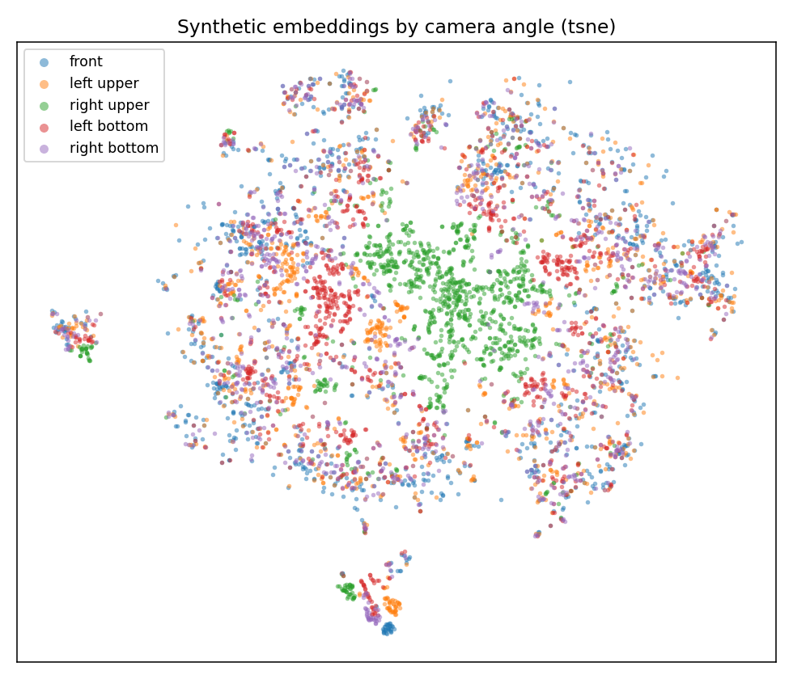
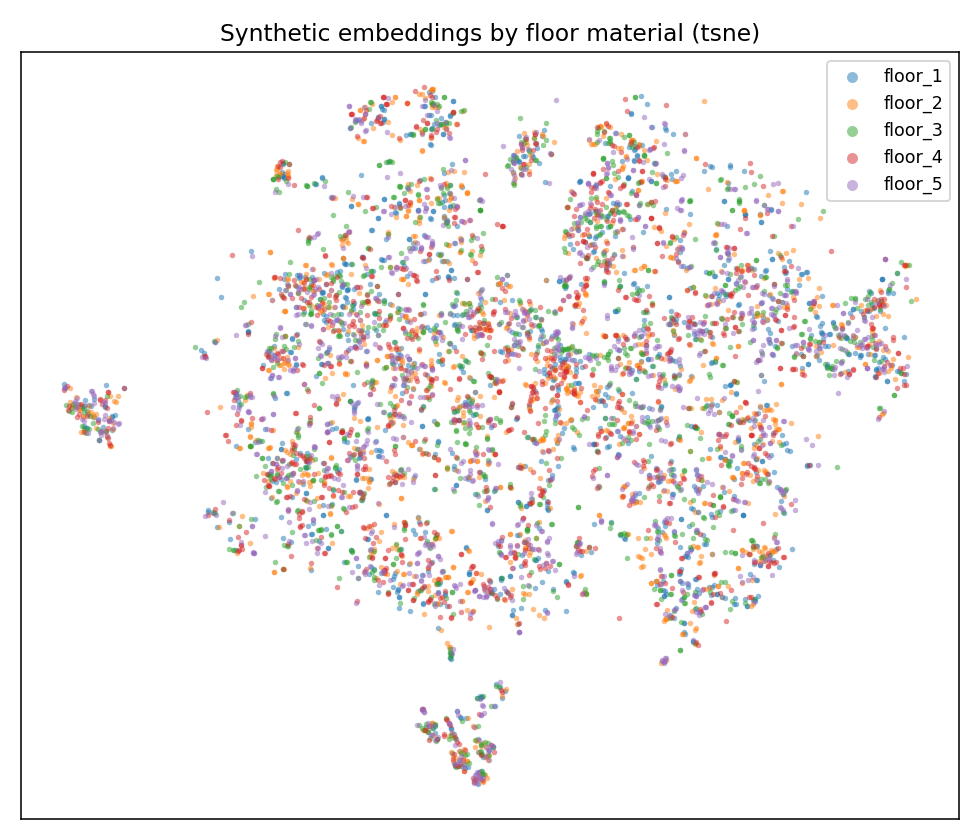
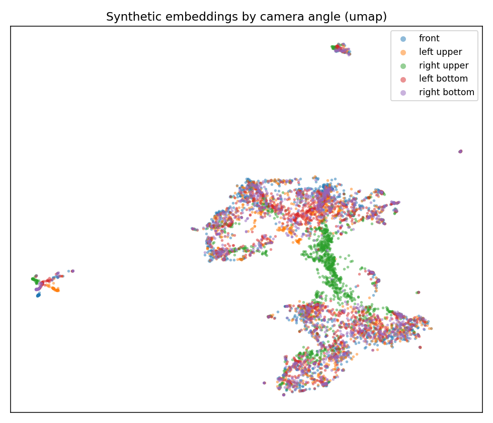
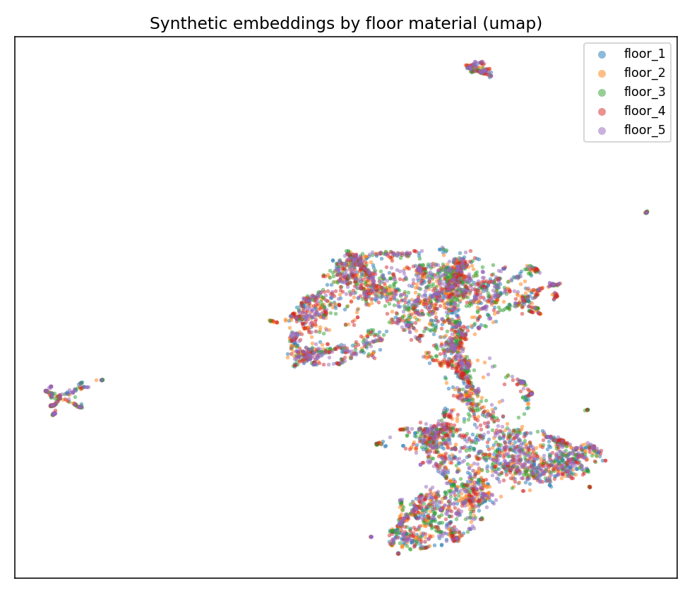
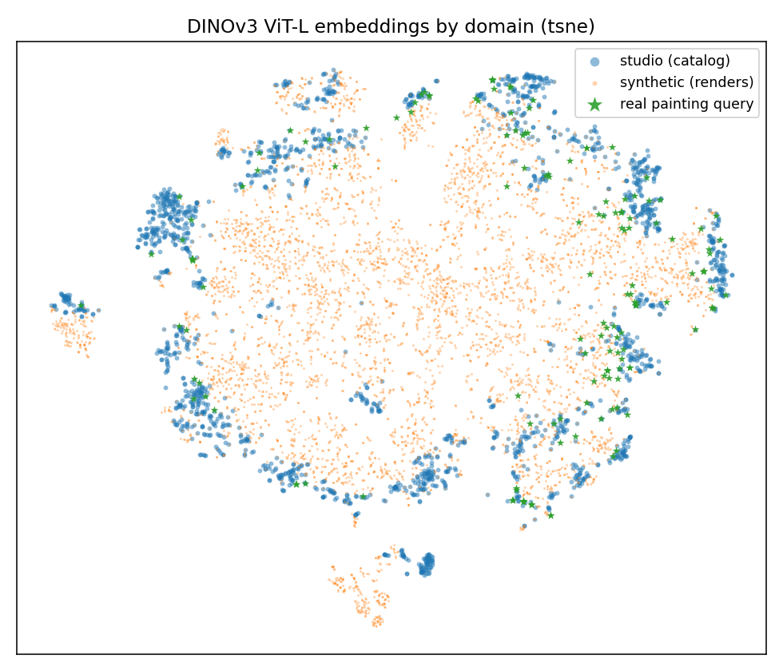
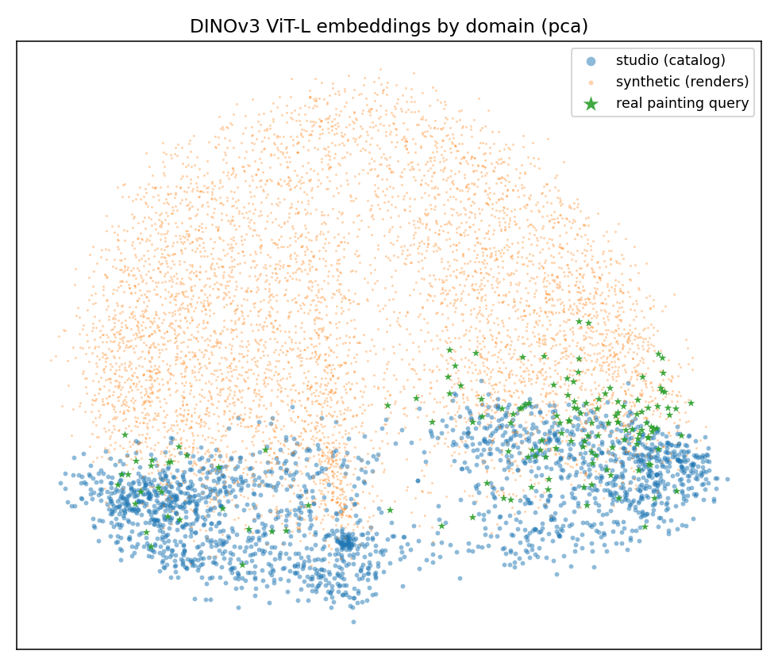
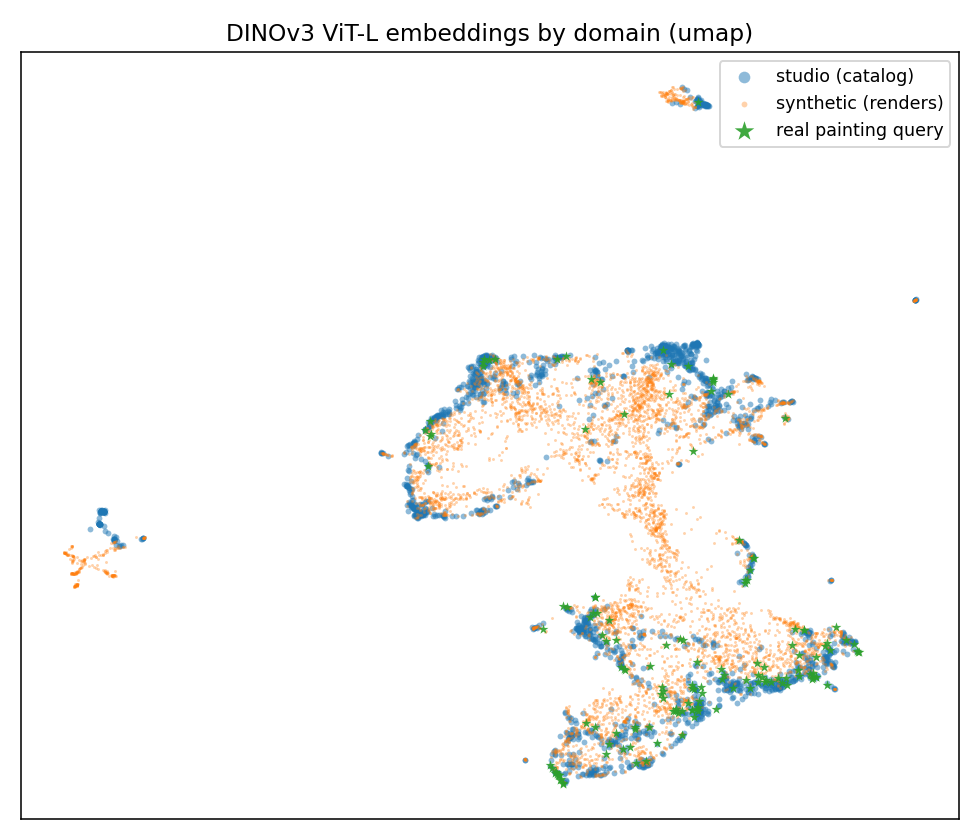

# DINOv3 embedding analysis of the synthetic gallery dataset

*Does a strong vision model organize our synthetic renders by **camera angle**, by the **random
scene settings** (floor, placard…), or by **which painting** they show — and how different are the
synthetic images from real ones? (Met / VISART fork; lab notebook: [`EXPERIMENTS.md` → EXP-7](../../EXPERIMENTS.md).)*

## What we did, in one paragraph

We pushed every image through a **frozen DINOv3 ViT-L** model and kept one feature vector per image —
think of it as the model's 1024-number "summary" of what the image looks like. Images the model
considers similar get similar vectors. We then ask: **what makes two images land near each other?**
We compare three sets of images:

| set | what it is | count |
|---|---|--:|
| **synthetic** | our gallery renders — 4,952 paintings × 5 camera views | 24,760 |
| **studio** | the catalog photo (`MET/<id>/0.jpg`) each render was built from | 4,952 |
| **real** | real Met visitor photos of paintings — the committed `Classification == "Paintings"` query set | 148 |

> **How to read the numbers.** Every comparison uses **cosine similarity**: we treat each image's
> vector as a direction and measure how aligned two directions are (more aligned = more similar).
> Recurring terms, one line each:
> - **Chance** — what a score would be if images were paired *at random*; the baseline to beat.
> - **Enrichment** — observed ÷ chance, i.e. *how many times more often than random* something happens.
> - **Linear-probe / kNN accuracy** — how well a simple classifier can read a property (angle, floor…)
>   off the vectors; a value far above *chance* means the model encodes that property strongly.
> - **Silhouette** (−1 to 1) — how "clustered" groups are: ≈1 tight, well-separated blobs; ≈0 no real
>   clustering (one connected cloud); below 0 the groups overlap.
> - **t-SNE / PCA / UMAP plots** — three ways to squash the 1024-number vectors down to a 2-D map so we
>   can eyeball them; nearby dots ≈ similar images.
>
> (This study uses the similarity metrics above, not the recognition metrics — **GAP**, **GAP⁻**, **ACC**,
> **R@1** — which are defined in the [experiments README](../README.md); only **R@1** reappears here, in §4.)

## TL;DR

- **The model groups images by *which painting* they show — not by the rendering settings.** A render's
  nearest neighbours are overwhelmingly the *other views of the same painting* (~1500× more often than random).
- **Camera angle is the strongest *secondary* pattern**, but it's a smooth gradient, not separate clusters.
- **The random scene settings (floor, placard) are almost ignored** by the model. (We couldn't test the
  random lighting — it isn't recorded in the metadata.)
- **Synthetic, studio, and real photos form three clearly distinct groups** — there's a real, large gap
  between synthetic and real.
- **The renders are "too clean":** none of them sit any closer to the *real photos* than the plain studio
  catalog images already do. So the synthetic data helps as **extra variety for training**, not by looking
  like real visitor photos.
- The **camera-framing bug from EXP-3 shows up here too**, found by a completely different method.

---

## 1. Setup

- **Model:** DINOv3 ViT-L/16, frozen (used as-is, no fine-tuning). We keep its single per-image summary
  vector (the "CLS token"), scaled to unit length so we compare images by direction (cosine).
- **Why it's comparable:** the real images reuse vectors already extracted by the sibling *art-research*
  repo with the *exact same* model and image pre-processing, so synthetic vs. real is apples-to-apples.
- **Scene settings we could recover** from each render's `metadata.json` (via
  [`scripts/synth_meta.py`](../../scripts/synth_meta.py)): camera angle (5), floor texture (5 options),
  placard position, painting shape (aspect ratio). ⚠️ The random **lighting is *not* recorded**, so we
  could not test it.

---

## 2. What makes two renders similar to the model?

The most direct test: for each render, look at its **10 nearest neighbours** (the 10 most similar
renders) and ask what they have in common.

One wrinkle to handle first: the scene is randomized **once per painting**, so all 5 views of a painting
share the *same* floor. That means a neighbour that is the *same painting* is automatically the *same
floor* too — which would make floor look more important than it is. So for angle and floor we only count
neighbours that are a **different painting**, which removes that bias.


| out of a render's 10 nearest neighbours, the fraction that are… | observed | chance | enrichment |
|---|--:|--:|--:|
| the **same painting** (any angle) | **0.25** | 0.0002 | **~1500×** |
| (different painting) the **same camera angle** | **0.68** | 0.20 | 3.4× |
| (different painting) the same floor texture | 0.28 | 0.20 | 1.4× |

*Observed = what we measured; chance = the same fraction if neighbours were random; enrichment = observed ÷ chance.*

**Plain reading:** identity wins by a mile — there are only 4 other views of the same painting out of
24,759 images, yet on average 2–3 of a render's 10 neighbours are them. Among *different* paintings,
camera angle is a strong tie (3.4× chance), while floor texture is barely above random (1.4×).

We can also ask how easily each property can be *read off* the vectors with a simple classifier:

| property of a render | linear-probe acc. | kNN acc. | silhouette | chance |
|---|--:|--:|--:|--:|
| **camera angle** (5) | **0.99** | 0.72 | 0.02 | 0.20 |
| floor texture (5) | 0.59 | 0.50 | −0.01 | 0.21 |
| placard position (4 bins) | 0.55 | 0.54 | −0.01 | 0.25 |
| painting shape / aspect (4 bins) | 0.73 | 0.67 | −0.01 | 0.25 |

*Accuracies run 0–1 (1 = perfect); well above "chance" = strongly encoded. Silhouette ≈ 0 everywhere = the
images form one connected cloud, not separate blobs.*

So camera angle is **almost perfectly readable** (0.99) — it's a clear, consistent direction in the
vector space — but its silhouette ≈ 0, meaning it's a smooth gradient layered on top of painting identity,
**not** a set of distinct clusters. Floor and placard are close to chance. (Painting shape scores higher,
but that's a property of the *painting itself*, not a random setting.)

The 2-D maps show the same thing — soft angle structure (watch the broken `right upper` view break away),
and floor texture scattered at random. **t-SNE** (top) and **UMAP** (bottom) tell the same story:

| | coloured by camera angle | coloured by floor texture |
|---|---|---|
| **t-SNE** |  |  |
| **UMAP** |  |  |

*(No PCA panel here: a linear PCA-2D doesn't resolve the angle gradient that t-SNE/UMAP pick up — the
0.99 linear-probe above is the quantitative proof that angle is encoded.)*

---

## 3. How far is synthetic from real?

First: are the three image sets even distinguishable? We check whether a simple straight-line classifier
can tell them apart.

| can a classifier tell these apart? | accuracy |
|---|--:|
| studio vs. synthetic vs. real (all three) | **0.99** |
| studio vs. synthetic | 0.99 |
| studio vs. real photo | 0.97 |
| synthetic vs. real photo | 0.97 |

*Accuracy near 1.0 = the groups barely overlap — they're clearly distinct regions of the space.*

The same three image sets, in all three 2-D projections (click any to enlarge):

| t-SNE | PCA | UMAP |
|---|---|---|
|  |  |  |

*The linear **PCA** view separates studio / synthetic / real most cleanly; **t-SNE** and **UMAP** mix them
more, because they preserve *local* neighbourhoods — and locally a render sits next to its same-painting
studio/real counterparts (the identity-dominates effect from §2). The 0.97–0.99 classifier scores above,
not any single 2-D map, are the evidence the domains are distinct.*

The more interesting question is **which gap is bigger** — synthetic-to-real, or studio-to-real? We measure
the distance between the *average* vector of each group:

| distance between group averages | value |
|---|--:|
| studio ↔ real photo *(the gap we ultimately care about)* | **0.22** |
| synthetic **front** view ↔ studio | **0.15** |
| synthetic front view ↔ real photo | 0.23 |
| synthetic `left upper` view ↔ studio | 0.30 |
| synthetic `right upper` view ↔ studio | 0.62 |

*Distance is "1 − cosine similarity" between the average vectors: 0 = identical direction, bigger = more
different. As a yardstick, the real studio→photo gap is 0.22.*

The synthetic **front** view is actually *closer to the studio photos* (0.15) than the real photos are
(0.22), and **no** synthetic view is any closer to real photos than the studio images already are. In
other words, **the renders look like clean studio shots, not like real visitor photos.** This fits what we
saw in EXP-4 (adding synthetic data helped *all* query types): the benefit comes from **extra training
variety**, not from the renders matching the real-photo "look".

---

## 4. The camera-framing bug shows up again

For each render we measure how similar it is to the *exact* catalog photo it was made from. This drops off
in the same order as the retrieval accuracy from EXP-3 — even though that was a *different* model and a
*different* test:


| camera view | similarity to its own studio photo | EXP-3 retrieval R@1 |
|---|--:|--:|
| front | 0.84 | 64.84% |
| left upper | 0.72 | 75.85% |
| right bottom | 0.71 | 21.95% |
| left bottom | 0.65 | 20.62% |
| **right upper** | **0.44** | **1.41%** |

*Similarity: 1 = identical to its source photo. R@1 (recall@1) = how often retrieval ranks the correct
painting first.*

The `right upper` render barely resembles its own painting (0.44 vs. front's 0.84) and is the most
isolated view in the space — exactly the grazing, edge-on framing bug found in EXP-3, now confirmed from a
completely independent angle. (The middle views don't line up perfectly, because being *findable* depends
on standing out from *other* paintings, not just resembling your own — and EXP-3 used a different model.)

---

## 5. What this means

- **DINOv3 is a good base for this task:** it sees past the random gallery background and groups images by
  the actual artwork — which is exactly what we want for recognizing paintings.
- **Don't trust per-view synthetic scores until the camera rig is fixed:** the `right upper` view (and the
  foreshortened `*bottom` views) are genuinely broken.
- **To actually close the gap to real photos**, the renders probably need to be *less* clean — more of the
  messiness of real visitor photos (phone-camera optics, odd angles, real lighting, blur, people in the
  way), not just more viewpoints.
- **Worth trying next:** (a) repeat with the bigger DINOv3-7B or with our fine-tuned model, to see if
  training pulls synthetic toward the real-photo region; (b) make side-by-side picture sheets of
  cross-group nearest neighbours to show the "too clean" effect visually.

---

## 6. Caveats

- This is the **frozen, off-the-shelf** DINOv3 ViT-L — not our fine-tuned model and not the bigger 7B one.
- We compare by **cosine similarity** on the raw vectors — not the whitening step the retrieval pipeline uses.
- The random **lighting** isn't recorded in the metadata, so it couldn't be tested.
- The real-photo set is small (148 painting photos — the committed `Classification == "Paintings"` queries).

---

## 7. How to reproduce

Run in `.venv-dino` (DINOv3 + `transformers`; the analysis also needs `scikit-learn`, `umap-learn` + `matplotlib`).

```bash
# 1) compute DINOv3 ViT-L vectors for the 24,760 renders (GPU, ~2 min on an H100)
sbatch slurm/extract_synth_dino.slurm
# 2) gather the real reference vectors + run the analysis (CPU)
sbatch slurm/analysis_synth_dino.slurm
# -> data/synth_dino/analysis/{summary.json, *.png}
```

Code: [`scripts/synth_meta.py`](../../scripts/synth_meta.py) (reads the scene settings) ·
[`scripts/extract_synth_dino.py`](../../scripts/extract_synth_dino.py) ·
[`scripts/assemble_real_dino.py`](../../scripts/assemble_real_dino.py) ·
[`scripts/analyze_synth_dino.py`](../../scripts/analyze_synth_dino.py).
Every number above comes from `data/synth_dino/analysis/summary.json`.
