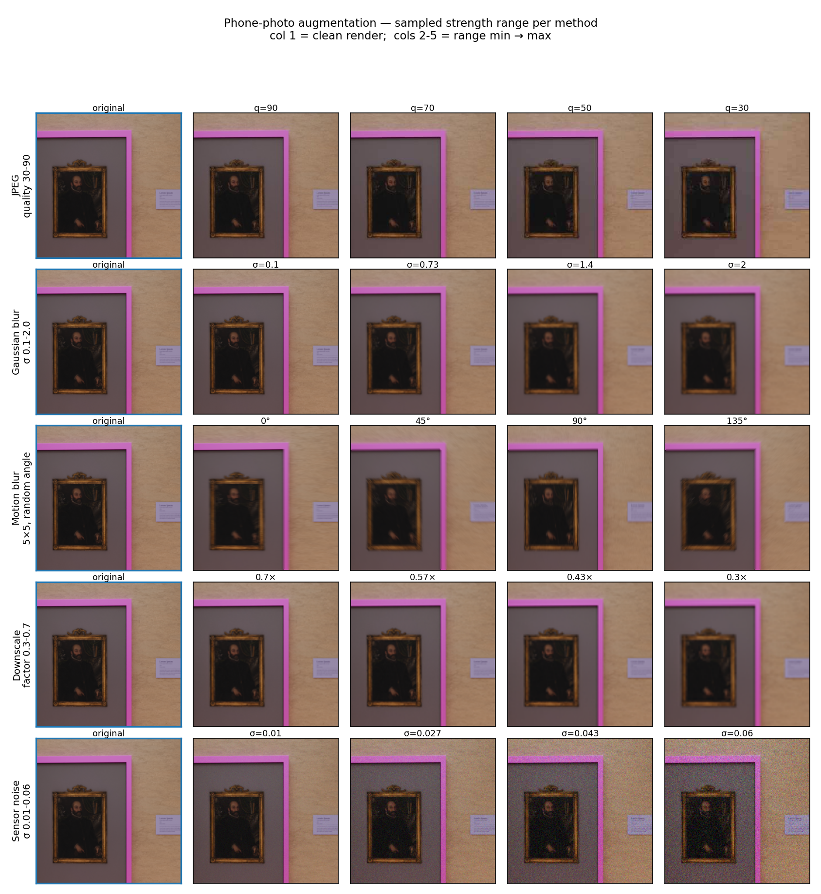
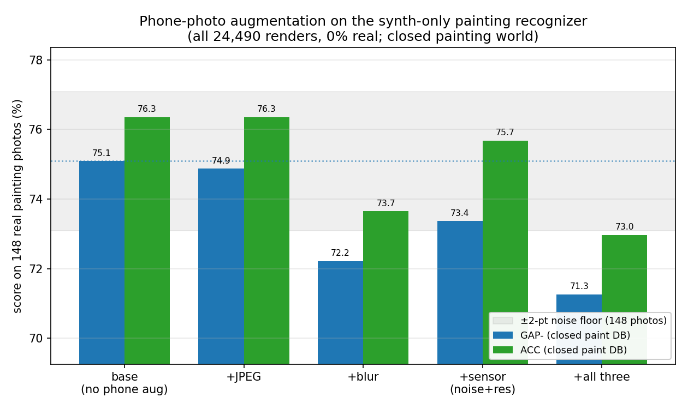
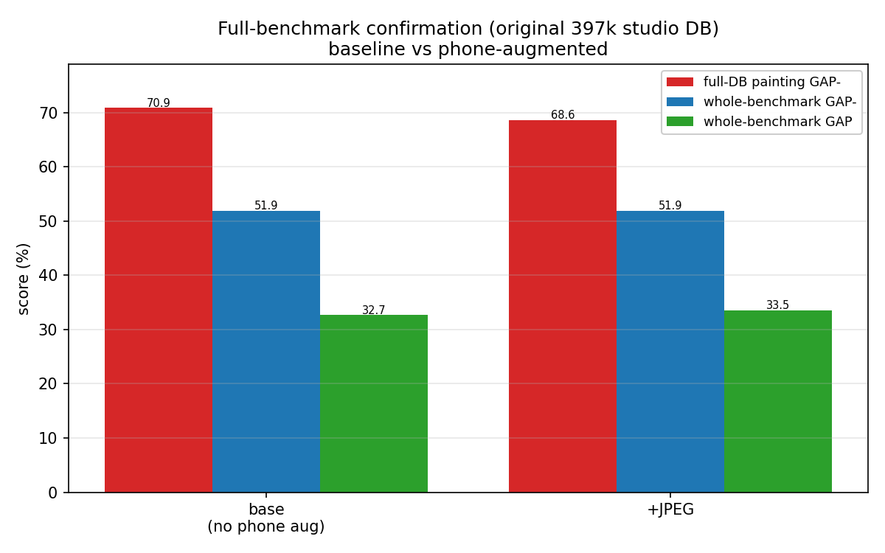

# Phone-photo augmentation: can simulated camera artifacts make synthetic training even better?

*Our best painting recognizer is trained on **synthetic gallery renders only** (all 24,490, zero real
photos). The renders are **"too clean"** — they capture viewpoint, glass and lighting but not the
artifacts of an actual phone snapshot. Here we add those artifacts — **JPEG compression, camera blur,
sensor noise + resolution loss** — as **training-time augmentation**, and ask whether teaching the model
to ignore them improves recognition of **real** painting photos. (Met / VISART fork; lab notebook:
[`EXPERIMENTS.md` → EXP-9](../../EXPERIMENTS.md). Iterates directly on
[`real-vs-synthetic-mix` → "24,490 (1.97×, all renders)"](../real-vs-synthetic-mix/README.md).)*

## What we did, in one paragraph

We took the **single best synth-only model** from the mixing study — the one trained on **all 24,490
gallery renders, 0 % real** — and retrained it **four more times**, changing **only the training-time
augmentation**. Three runs each add **one** family of phone-camera artifact (JPEG compression; camera
blur; sensor noise + resolution loss); a fourth **stacks all three**. Everything else is frozen: the
exact same 24,490 renders, the same R18-SWSL recipe, 10 epochs, seed 0 — so each run is a clean A/B
against the no-augmentation baseline. Artifacts are injected **only during training** (and to *both*
images of every contrastive pair); the **real test photos are never touched**. We score every model on
the **same 148 real painting photos**, primarily in the **closed painting world** (search the 12,403
painting photos), then confirm the best on the **full 397k Met benchmark**.

> **How to read the numbers** — all scores are 0–100, higher is better; **GAP / GAP⁻ / ACC** are defined
> once in the [experiments README](../README.md). The headline metric here is **GAP⁻ on the closed
> painting DB** (= the mixing study's scaling metric, where the baseline scores **75.09**). With only
> **148** test photos, single differences **≤ ~2 points are within noise** — read the direction and
> size of an effect, not a one-point ranking.

## TL;DR

- **Phone-photo augmentation does not improve the synth-only recognizer — a negative result.** No arm
  beats the no-augmentation baseline (GAP⁻ 75.09 / ACC 76.35).
- **Mild JPEG is a tie; everything stronger hurts.** JPEG: −0.2 GAP⁻, identical ACC (within noise).
  Sensor noise+resolution: −1.7. Blur: −2.9. **All three stacked: −3.8 — the worst, beyond the noise
  floor.** The damage is **monotone in augmentation aggressiveness**.
- **Why (our reading):** instance-level painting recognition lives on **fine brushwork / texture
  detail**, and blur, noise and downscaling destroy exactly that — on *both* views of every contrastive
  pair. The renders already supply the *useful* variation (viewpoint, glass, lighting — EXP-7), so the
  extra pixel-level invariance wasn't the bottleneck, but the detail it sacrificed was.
- **Takeaway for the VISART contribution:** the synthetic data's value comes from **scene-level realism**,
  not pixel-level degradation. To push further, fix the camera rig and render *more* (EXP-8 showed no
  data plateau) rather than augment harder.

## The augmentations

Each artifact is a torchvision-style transform applied with **probability 0.5** per image (so the model
still sees clean views), layered **on top of** the existing crop + colour-jitter + grayscale recipe. The
strengths are deliberately **mild–moderate** so a painting stays recognizable.

| arm | simulates | transform (train-time, each at p = 0.5) |
|---|---|---|
| **base** | — *(the EXP-8 24,490-render recipe, unchanged)* | RandomResizedCrop + ColorJitter + RandomGrayscale only |
| **jpeg** | phone JPEG compression / blocking | re-encode as JPEG at a random quality **30–90** |
| **blur** | autofocus miss / handshake | Gaussian blur **σ ∈ [0.1, 2]** *or* a 5×5 directional **motion** blur (random) |
| **sensor** | low-light grain + distance / resolution loss | **downscale ×[0.3, 0.7] then upscale** back; **+** additive Gaussian **noise σ ∈ [0.01, 0.06]** |
| **phoneall** | all three at once | jpeg **+** blur **+** downscale **+** noise, each fired independently at p = 0.5 |



*Each **row** is one phone artifact; the **first column** is the clean render and **columns 2–5 sweep
that artifact's randomized strength from the minimum to the maximum of its training range** (the value is
annotated on every cell). During training a strength is drawn **uniformly** from each range and applied
at **p = 0.5**, on top of crop + colour-jitter — so a given view receives a random subset of the
artifacts at random strengths. Nothing here is exaggerated: every value shown is within the range the
model actually samples. (Motion blur randomizes the **angle** for a fixed 5×5 kernel, so its row sweeps
direction rather than magnitude.)*

## Results

**Painting recognition — the 148 real painting photos vs the closed painting DB** (2-fold-CV K/τ,
identical protocol to the mixing study):

| training augmentation | GAP⁻ (paint DB) | ACC (paint DB) | Δ GAP⁻ vs base |
|---|--:|--:|--:|
| **base — no phone aug** (= the all-renders model) | **75.09** | **76.35** | — |
| +JPEG | 74.87 | 76.35 | −0.22 |
| +sensor (noise + resolution) | 73.37 | 75.68 | −1.72 |
| +blur | 72.22 | 73.65 | −2.87 |
| +all three | 71.26 | 72.97 | −3.83 |

*All five models train on the identical 24,490 renders (0 % real), seed 0; only the augmentation
differs. Closed world → no distractors → GAP = GAP⁻. Differences ≤ ~2 points are within noise.*



*Bars = GAP⁻ (blue) and ACC (green) per arm; dotted line = the baseline; the grey band is the ±2-point
noise floor around it. JPEG sits inside the band (a tie); blur, sensor and the three-way stack fall
below it, and the more aggressive the augmentation, the bigger the drop.*

**Full-benchmark confirmation — best arm (+JPEG) vs the baseline**, original 397k studio DB:

| model | full GAP | full GAP⁻ | full ACC | paint GAP⁻ (148, full DB) | paint ACC |
|---|--:|--:|--:|--:|--:|
| base (all-renders) | 32.68 | 51.94 | 54.34 | 70.90 | 72.30 |
| +JPEG | 33.53 | 51.89 | 54.54 | 68.63 | 70.27 |

*Full-DB numbers: GAP includes the 18,316 distractors; the painting slice uses fixed K=7, τ=50 (EXP-2
protocol). The confirmation upholds the tie: overall GAP⁻/ACC are flat (−0.05 / +0.20), the
distractor-sensitive GAP ticks up (+0.85 — mild JPEG seems to help reject junk queries a little), and
the 148-photo painting slice ticks down (−2.3 GAP⁻) — every delta at or below the noise floor. Nothing
here changes the headline: no gain from phone augmentation.*



*Base vs +JPEG on the full 397k benchmark — the two models are equivalent on every metric.*

## What it means

- **The renders' "too clean" gap is not made of pixel-level artifacts.** EXP-7 measured a clear
  synthetic↔real-query embedding gap and we guessed phone-capture degradation might be the missing
  ingredient. Injecting exactly those degradations made nothing better and most things worse — so the
  remaining studio→phone shift is evidently more about scene/geometry/colour rendition than about JPEG
  blocks, blur or grain. (The real ≤500 px query photos are simply not that degraded.)
- **Detail is the currency of instance recognition.** Telling one painting from 4,898 others hinges on
  fine brushwork and texture; augmentations that erase high-frequency content (blur, noise, downscale)
  erase the evidence — and in contrastive training they corrupt **both** views of every pair. The
  monotone drop (jpeg ≈ tie → sensor → blur → all three) tracks exactly how much high-frequency
  information each artifact removes.
- **The base recipe already covers the useful invariances.** Crop + colour-jitter + grayscale (the
  paper's recipe) plus the renders' built-in viewpoint/glass/lighting variation (EXP-4/EXP-7) appear to
  saturate what augmentation can give here; the marginal augmentation that remained to be added was the
  harmful kind.
- **Where the headroom actually is:** EXP-8's scaling result (more renders kept helping, no plateau) and
  the broken `right upper` camera view point to **more/better renders**, not heavier augmentation.

## How we trained (identical to the synth-only baseline — only the augmentation changes)

Every run uses the **same recipe** as the mixing study's all-renders point (itself the step-1 paper
recipe with synthetic data): backbone **R18-SWSL** from ImageNet-SWSL weights, **10 epochs**,
contrastive loss with hard-pair mining (`new_pos+new_neg`), projector + PCA-whitening init, **seed 0**,
paper defaults (lr 1e-7, 64 pairs/batch, margin 1.8, weight-decay 1e-6, LR step 6×0.1, image size 500).
The data is **fixed**: `data/gt_paint_synthall` — all **24,490** renders of **4,898** painting classes,
**0 % real**. The **only** change between runs is the `--aug` arm (`code/utils/augmentations.py`,
`build_train_transform`). Augmentation touches **training only**; descriptor extraction and the kNN
eval are unchanged, so the **148 real test photos and the studio databases are never augmented**.

Retrieval knobs (K, τ) are set exactly as in the mixing study: the closed world tunes them by **2-fold
cross-validation** on the 148 test photos (val has only 1 painting query), and the full-benchmark
numbers tune on the real validation set; the full-DB painting slice uses the fixed **K = 7, τ = 50**.
See [real-vs-synthetic-mix → "How we set the retrieval knobs"](../real-vs-synthetic-mix/README.md).

## Caveats

- **Small test set:** 148 painting photos, 1 validation photo. Single differences **≤ ~2 points are
  within noise** — and the 2-fold CV shows it directly: the sensor arm's two 74-photo folds score 70.41
  vs 76.33 (a 6-point spread between halves). Trust the direction and the monotone pattern, not exact
  rankings; JPEG-vs-base in particular is a tie, not a deficit. We screen at a **single seed (0)**, so a
  marginal arm cannot be cleanly separated from noise.
- **Closed-world scores are not comparable to the paper's GAP 36.1** (12 k vs 397 k DB). Across-arm
  comparisons are fair (identical test each time); the full-benchmark columns are the comparable ones.
- **The renders still have the broken `right upper` camera view** (EXP-3 / EXP-7) — augmentation does
  not fix a bad pose; it only adds capture-side artifacts.
- **Augmentation ≠ the real shift.** These artifacts are a *hand-built guess* at the studio→phone gap
  (EXP-7 showed the renders don't reproduce it). The result says this guess was wrong for this task —
  not that no augmentation could ever help.
- **One strength schedule tested.** Each artifact fired at p = 0.5 with the table's (mild–moderate)
  ranges. A gentler schedule (lower p, weaker maxima) might land at "harmless" rather than "harmful" —
  but given even these mild settings only managed a tie at best, we didn't sweep further.

## Reproduce

```bash
# 1) baseline = the existing all-renders synth-only model (data/models/r18SWSL_paint_synthall)
# 2) four augmentation arms (training -> dependent closed-world eval):
INFO=data/gt_paint_synthall; IM=data/aug
for arm in jpeg blur sensor phoneall; do
  tid=$(sbatch --parsable --job-name=met-tr-aug-$arm slurm/paint_train.slurm $INFO $IM paint_synth_$arm $arm)
  sbatch --dependency=afterok:$tid --job-name=met-ev-aug-$arm \
         slurm/paint_eval.slurm data/models/r18SWSL_paint_synth_$arm 10 aug_$arm
done
# 3) full-benchmark confirmation for the baseline + best arm(s):
sbatch --job-name=met-full-aug-<arm> slurm/eval_full.slurm data/models/r18SWSL_paint_synth_<arm> 10 aug_<arm>
# 4) figures (montage + results):
.venv-dino/bin/python scripts/plot_phone_aug.py     # -> figures/fig_examples.png, fig_arms.png, fig_confirm.png
```

The augmentation arms are defined by `ARMS` in `code/utils/augmentations.py`; `--aug <arm>` selects one
(`base` = no phone augmentation = the unchanged recipe).
