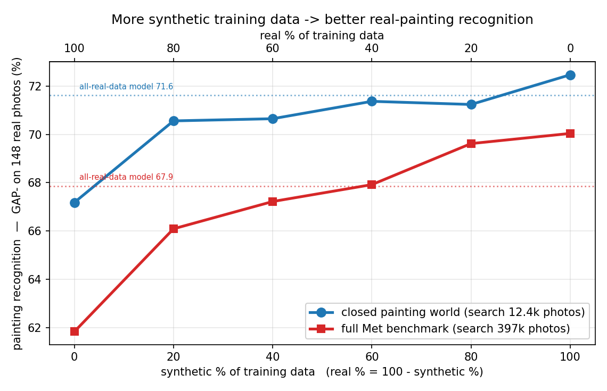
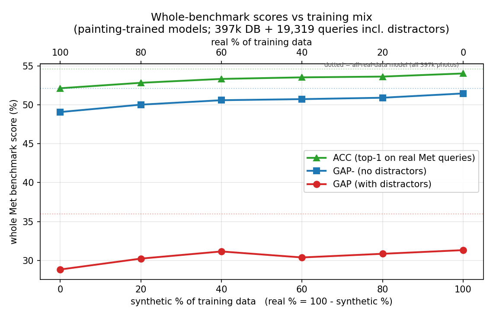
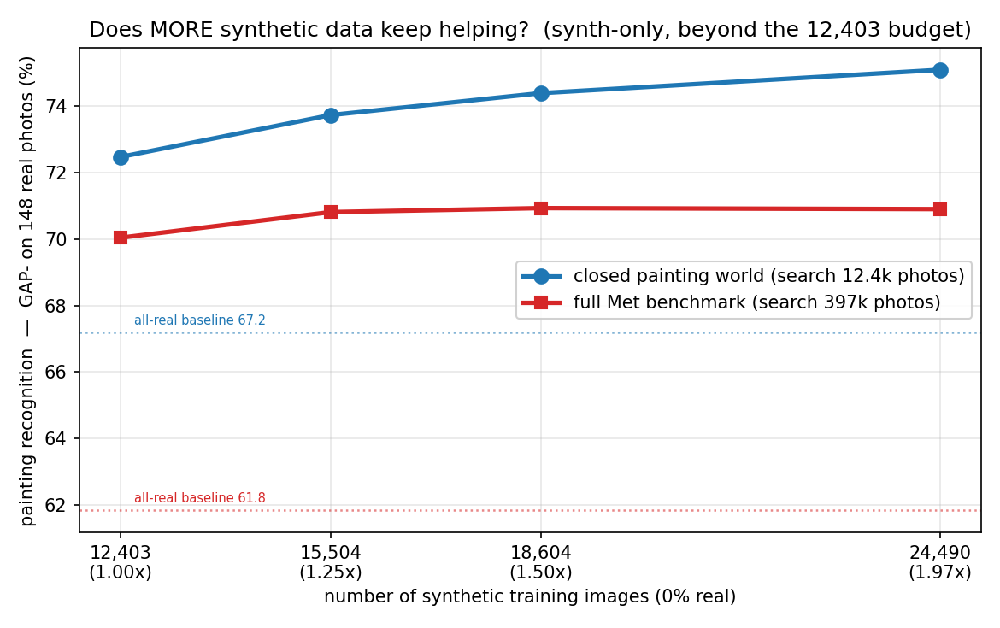

# Real vs synthetic training data: how much synthetic helps for paintings

*We train the painting recognizer on different blends of **real** museum photos and **synthetic**
gallery renders, then test every model on the **same real painting photos**. Which blend recognizes
real paintings best? (Met / VISART fork; lab notebook: [`EXPERIMENTS.md` → EXP-8](../../EXPERIMENTS.md).)*

## What we did, in one paragraph

We trained the painting recognizer **six times**. Each run saw the **same number of training images
(12,403)**, but with a different blend of **real** museum catalog photos and **synthetic** gallery
renders — from **100 % real** (no synthetic), in five steps, down to **0 % real / 100 % synthetic**.
Synthetic images are used **only for training**; every model is tested on the **same set of real
painting photos**. We score each model two ways: an easy **"closed painting world"** (pick the right
painting out of ~12 k painting photos) and the **full Met benchmark** (find the right painting among
**all 397 k** museum photos while also ignoring ~18 k "distractor" junk queries). The question: as we
trade real training photos for synthetic ones, does recognizing real paintings get better or worse?

> **How to read the numbers** — all scores are 0–100, higher is better; metric definitions (**GAP**,
> **GAP⁻**, **ACC**) are in the [experiments README](../README.md). Results split into two tables by
> **query set**, and within them two **databases**:
> - **query set** — the **painting-recognition** table scores just the **148 real painting photos**; the
>   **full-benchmark** table scores all **1,003** real Met queries.
> - **database** — **paint DB** = search only the 12,403 painting photos (easy; no distractors, so
>   GAP = GAP⁻); **full DB** = search all 397,121 photos (the original Met task — its GAP includes the
>   18,316 distractors, GAP⁻ excludes them). The prose and figures call these the *closed painting
>   world* and the *full Met benchmark*.

## TL;DR

- **Synthetic data helps — and more is better.** Shifting training from all-real to all-synthetic,
  real-painting recognition climbs **steadily**, in *both* test settings.
- **Training on synthetic *alone* (zero real photos) is the best of the six.** It beats the all-real
  baseline everywhere, and on paintings it **beats the original model trained on all 397 k real photos**
  on **both** databases (paint-DB 72.5 vs 71.6; full-DB 70.0 vs 67.9) — using ~32× less data and
  not one real painting photo.
- **Why it works:** the test photos are real *gallery* shots; the "real" training photos are clean
  *studio* shots. The synthetic renders imitate gallery conditions (angle, glass, lighting), so they
  teach the right kind of variation. (Consistent with EXP-4 and EXP-7.)
- **The catch on the full benchmark:** these models only ever trained on paintings, so they're weaker
  at rejecting the 18 k distractors — that drags down **GAP**. On the painting-relevant scores
  (**GAP⁻, ACC, and the painting slice**) they essentially match the full-data model.
- **Honest limit:** only **148** painting test photos, so gaps of ≤ ~2 points are noise. Trust the big
  all-real → all-synthetic jump and the steady trend, not the exact ordering of the middle blends.

## Results — all six models

**Painting recognition — the 148 real painting photos** (the contribution's target), against both databases:

| training mix (real:synth) | GAP⁻ (paint DB) | ACC (paint DB) | GAP⁻ (full DB) |
|---|--:|--:|--:|
| 100:0 — all real | 67.18 | 70.27 | 61.83 |
| 80:20 | 70.56 | 72.97 | 66.09 |
| 60:40 | 70.65 | 72.30 | 67.22 |
| 40:60 | 71.37 | 72.97 | 67.92 |
| 20:80 | 71.24 | 72.30 | 69.62 |
| **0:100 — all synthetic** | **72.47** | **73.65** | **70.04** |
| *reference: all-real-data model (397k)* | *71.62* | *72.30* | *67.86* |

*paint DB = search only the 12,403 painting photos (no distractors → GAP = GAP⁻); full DB = search all
397,121 photos. Reference = the original model trained on all 397k real photos. Best run in bold.*

**Full Met benchmark — all 1,003 real Met queries vs the full 397k DB** (how these painting-only-trained
models do on the whole task):

| training mix (real:synth) | GAP | GAP⁻ | ACC |
|---|--:|--:|--:|
| 100:0 — all real | 28.83 | 49.08 | 52.14 |
| 80:20 | 30.23 | 50.03 | 52.84 |
| 60:40 | 31.15 | 50.60 | 53.34 |
| 40:60 | 30.38 | 50.74 | 53.54 |
| 20:80 | 30.85 | 50.92 | 53.64 |
| **0:100 — all synthetic** | **31.32** | **51.47** | **54.04** |
| *reference: all-real-data model (397k)* | *35.97* | *52.14* | *54.64* |

*GAP includes the 18,316 distractors, GAP⁻ removes them, ACC is top-1. Same models as above.*



*The headline: more synthetic training data → better recognition of the same 148 real painting photos,
in both the easy closed world (blue) and the hard full benchmark (red). Dotted = the all-real-data model.*



*On the whole benchmark, GAP⁻ and ACC rise with synthetic and nearly reach the all-real-data model
(dotted). GAP (with distractors) stays lower — these painting-only models are weaker at rejecting the
18 k junk queries.*

## What it means

- **For this task, synthetic gallery renders are better training material than real studio photos.**
  We test on real *gallery* photos, and the renders resemble those more than clean studio catalog shots
  do — so even with zero real photos the all-synthetic model recognizes real paintings best.
- **The win is specific to paintings.** On the full benchmark the painting-only models can't reject the
  18 k distractors as well as a model trained on all 224 k classes, so the distractor-sensitive **GAP**
  stays below the full-data model — but on the painting slice they **beat** it (GAP⁻ 70.0 vs 67.9, ACC
  71.6 vs 69.6), which is exactly the domain the VISART contribution targets.
- **Takeaway:** for a painting recognizer, synthetic gallery renders aren't merely a cheap stand-in for
  real data — here they are *better* than the real studio images we have.

## Does more synthetic data keep helping? (synth-only, beyond the budget)

The sweep above capped every run at 12,403 training images, so "100% synthetic" used only ~half of the
24,490 renders we have. Here we lift that cap: keep training **100% synthetic / 0% real** and simply
**add more renders** — 1× (12,403, the existing point), 1.25×, 1.5×, and all 24,490 (~2×). Each set is a
superset of the previous (same shuffle, longer prefix); recipe and evaluation are unchanged.

**Painting recognition — 148 real painting photos:**

| synthetic training images | GAP⁻ (paint DB) | ACC (paint DB) | GAP⁻ (full DB) |
|---|--:|--:|--:|
| *all-real baseline (12,403 real, 0 synthetic)* | *67.18* | *70.27* | *61.83* |
| 12,403 (1.00×, = 100%-synth) | 72.47 | 73.65 | 70.04 |
| 15,504 (1.25×) | 73.73 | 75.00 | 70.81 |
| 18,604 (1.50×) | 74.39 | 75.68 | 70.93 |
| **24,490 (1.97×, all renders)** | **75.09** | **76.35** | **70.90** |

**Full Met benchmark — 1,003 queries vs full 397k DB:**

| synthetic training images | GAP | GAP⁻ | ACC |
|---|--:|--:|--:|
| *all-real baseline (12,403 real, 0 synthetic)* | *28.83* | *49.08* | *52.14* |
| 12,403 (1.00×, = 100%-synth) | 31.32 | 51.47 | 54.04 |
| 15,504 (1.25×) | 31.86 | 51.79 | 54.34 |
| 18,604 (1.50×) | 32.18 | 51.81 | 54.24 |
| **24,490 (1.97×, all renders)** | **32.68** | **51.94** | **54.34** |



*Painting recognition (GAP⁻ on the 148 real photos) as we add more synthetic training images, 0% real.
Dotted lines = the all-real baseline; every scaling point sits far above it.*

**Findings (scaling).**
1. **Closed world: more synthetic keeps helping, no plateau.** GAP⁻ climbs 72.47 → 73.73 → 74.39 → 75.09
   (≈ +2.6 from 1× to all, roughly linear). The synth-only model is **data-limited** here — generating
   *more* gallery renders would likely push it further.
2. **Full benchmark: it plateaus fast.** The painting slice gains +0.8 (70.04 → 70.81) from the first
   extra batch, then flattens at ~70.9; overall GAP⁻/ACC barely move (+0.5 / +0.3). Beyond the
   size-matched budget, extra synthetic data helps the *easy* painting task but not the *hard* 397k-DB
   retrieval — there the bottleneck isn't painting-data quantity but the distractor problem.
3. **Every scaling point still beats the all-real baseline by a wide margin** (closed +5–8, full painting
   +9), reinforcing the headline. (This went against my prior guess that the "too clean" renders + the
   broken `right upper` view would flatten it immediately — in the closed world they don't.)

## How we trained (identical to the paper's model — only the data changes)

Every run uses the **same recipe** as our step-1 reproduction of the paper's best model (*R18-SWSL
Con-Syn+Real-closest*, EXP-1, GAP 35.97). The command (`slurm/paint_train.slurm`) is literally `slurm/train.slurm`
with the data swapped:

- backbone **R18-SWSL**, started from **ImageNet-SWSL** weights (fresh each run — not continued from a
  checkpoint);
- **10 epochs**, contrastive loss with hard-pair mining (`new_pos+new_neg`), projector + PCA-whitening
  init, **seed 0**;
- paper defaults unchanged: learning rate 1e-7, 64 pairs/batch, margin 1.8, weight-decay 1e-6, LR step
  6 ×0.1, image size 500.

The **only** differences between runs are the training images (the real:synth blend) and the image
folder. Backbone, init, **epoch count**, optimizer, schedule, and seed are identical across all six runs
and match step-1.

> **Same recipe ≠ same amount of training.** "1 epoch" means each training image is used once, so 10
> epochs over **12,403** painting images is ~**32× fewer weight updates** than step-1's 10 epochs over
> **397,121** images (≈ 22–32 min per run vs ≈ 21 h for step-1). Same recipe and epoch count; far fewer
> updates — worth remembering when comparing to the full-data reference.

## How we set the retrieval knobs (K and τ) with only one validation photo

The recognizer's last step is a **k-nearest-neighbor vote** with two knobs: **K** (how many nearest
training photos vote on a query) and **τ** (a temperature controlling how strongly closer matches
outweigh farther ones). These are normally chosen on a **validation set** — and that's the problem:
the closed painting world has only **1 validation photo**, nowhere near enough to choose K and τ.

**Closed world — tune on the test photos, but with 2-fold cross-validation** so nothing is ever scored
with knobs it helped choose (`scripts/eval_paintings_closed.py`):

1. Split the 148 painting test photos into two halves (fixed seed).
2. Grid-search K ∈ {1, 2, 3, 5, 7, 10, 15, 20, 50} × τ ∈ {0.01 … 500} on **half A**, keep the best
   (K, τ), and score **half B** with it.
3. Do the reverse — tune on **B**, score **A**.
4. Report the **average over the two held-out halves**. Every photo is scored by knobs tuned only on
   the *other* half, so there is no leakage.

**Full benchmark — a real validation set exists** (2,165 queries), so the overall GAP / GAP⁻ / ACC are
tuned the normal way, per model (`eval_fullgrid.py`). The painting slice (the same 148 photos) instead
uses a **fixed K = 7, τ = 50** — the values tuned for the original full-data model — applied identically
to every model, which keeps the cross-model comparison fair without needing painting-specific validation.

**Why this is trustworthy — the audit.** If "tuning on the test set" were quietly inflating the scores,
then the **leaky** version — choosing one (K, τ) on all 148 photos *and* reporting on those same 148 (an
optimistic upper bound we call the *oracle*) — would score noticeably higher than the honest 2-fold
number. It doesn't: they agree to within ~0.2 points everywhere. And **τ = 50 is picked in almost every
fold** (K ranges 2–50 but barely moves the score). So the knob choice is not what produces the
"synthetic helps" result.

| training mix (real : synth) | reported — honest 2-fold GAP⁻ | oracle — leaky upper bound GAP⁻ | difference |
|---|--:|--:|--:|
| 100 : 0 | 67.18 | 67.26 | +0.08 |
| 80 : 20 | 70.56 | 70.64 | +0.08 |
| 60 : 40 | 70.65 | 70.54 | −0.11 |
| 40 : 60 | 71.37 | 71.36 | −0.01 |
| 20 : 80 | 71.24 | 71.05 | −0.19 |
| 0 : 100 | 72.47 | 72.55 | +0.08 |
| all-real-data reference | 71.62 | 71.51 | −0.11 |

*The honest (cross-validated) score and the leaky (tune = report) score differ by ≤ 0.2 in either
direction — the tuning adds essentially no inflation. Closed-world numbers; the "oracle" column is a
sanity check, **not** a reported result.*

## Caveats

- **Small test set:** just 148 painting photos (and only 1 validation photo — hence the K/τ handling in
  *How we set the retrieval knobs* above). Single differences ≤ ~2 points are within noise — trust the
  big all-real → all-synthetic jump and the monotone trend, not the exact ordering of the middle blends.
- **Closed-world scores are not comparable to the paper's GAP 36.1** — searching 12 k photos is far
  easier than 397 k. Comparisons *across blends* are fair (identical test each time); the full-benchmark
  columns are the ones comparable to the paper / EXP-2.
- **The synthetic set still has the broken `right upper` camera view** (EXP-3 / EXP-7). The all-synthetic
  win happens *despite* that bad view — fixing the camera rig could help further.
- **Beyond the fixed 12,403 budget:** the *Does more synthetic data keep helping?* section lifts the cap
  — more renders keep helping in the closed world (up to GAP⁻ 75.1 with all 24,490 renders) but plateau
  on the full benchmark (~70.9).

## Reproduce

```bash
.venv/bin/python scripts/build_paintings_mix_data.py     # build the blended manifests (data/gt_paint_mix_*)
for tag in 80r20s 60r40s 40r60s 20r80s 0r100s; do        # train each blend (100/0 already = data/gt_paint)
  tid=$(sbatch --parsable --job-name=met-tr-$tag slurm/paint_train.slurm data/gt_paint_mix_$tag data/aug paint_$tag)
  sbatch --dependency=afterok:$tid --job-name=met-ev-$tag slurm/paint_eval.slurm data/models/r18SWSL_paint_$tag 10 $tag
done
# full-benchmark eval per model (tag = synthetic %): paint->0s, paint_80r20s->20s, ... paint_0r100s->100s
sbatch slurm/eval_full.slurm data/models/r18SWSL_paint 10 0s   # ...repeat for each model
sbatch slurm/eval_paint_cls.slurm                              # painting slice on the full 397k DB (148-photo def)
.venv-dino/bin/python scripts/plot_mixing_report.py      # -> fig_paintings.png, fig_full_benchmark.png
```
